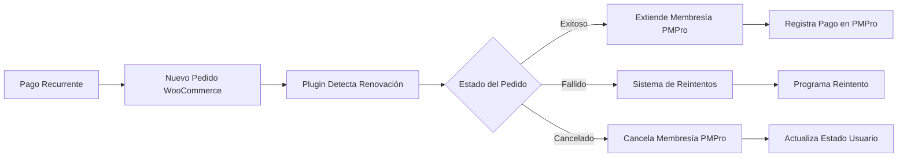

# PMPro-WooCommerce Sync Enhanced

## 🎯 Finalidad

Este plugin resuelve un problema específico en la integración entre **Paid Memberships Pro (PMPro)** y **WooCommerce** cuando se procesan pagos recurrentes a través de gateways como **PagBank**.

### El Problema
Cuando un usuario adquiere una membresía de PMPro a través de WooCommerce:
- El pago inicial se procesa correctamente
- La membresía se activa en PMPro
- Los pagos recurrentes se procesan en WooCommerce (creando nuevos pedidos)
- **PERO** PMPro no se actualiza automáticamente con las renovaciones

Esto resulta en:
- ❌ Membresías que expiran aunque el pago recurrente sea exitoso
- ❌ Usuarios perdiendo acceso a contenido pagado
- ❌ Falta de sincronización entre sistemas
- ❌ Registros de pagos desactualizados en PMPro

### La Solución
Este plugin mantiene **automáticamente sincronizadas** las membresías de PMPro con el estado real de las suscripciones en WooCommerce.

## 🔧 Funcionalidades

### ✅ Sincronización Automática
- **Renovaciones Exitosas**: Extiende automáticamente la membresía en PMPro
- **Pagos Fallidos**: Implementa sistema de reintentos configurables
- **Cancelaciones**: Cancela la membresía en PMPro cuando se cancela en WooCommerce
- **Fechas de Expiración**: Calcula y actualiza automáticamente las fechas de renovación

### ✅ Sistema de Reintentos Inteligente
- Reintentos automáticos para pagos fallidos
- Límite configurable de intentos
- Suspensión automática tras máximos reintentos
- Limpieza automática de intentos exitosos

### ✅ Logging y Monitoreo
- Logs detallados de todas las operaciones
- Función de debug para troubleshooting
- Rotación automática de logs
- Compatible con WP_DEBUG

### ✅ Compatibilidad Amplia
- Funciona con WooCommerce Subscriptions
- Compatible con PagBank y otros gateways
- Detecta múltiples tipos de pedidos de renovación
- Integración con webhooks existentes

## 🏗️ Arquitectura

### Flujo de Funcionamiento

1. **Usuario realiza compra inicial** → PMPro + WooCommerce se sincronizan normalmente
2. **Gateway procesa pago recurrente** → WooCommerce crea nuevo pedido
3. **Plugin detecta renovación** → Verifica si es pedido de suscripción
4. **Sincronización automática** → Actualiza PMPro según estado del pedido



### Estados Manejados

| Estado WooCommerce | Acción en PMPro |
|---|---|
| `completed` | ✅ Extiende membresía + registra pago |
| `processing` | ✅ Extiende membresía + registra pago |
| `failed` | ⚠️ Programa reintento automático |
| `cancelled` | ❌ Cancela membresía |

## 📥 Instalación

### Requisitos Previos
- WordPress 5.0+
- WooCommerce 4.0+
- Paid Memberships Pro 2.0+
- PHP 7.4+

### Pasos de Instalación

1. **Descarga el archivo `pmpro-woo-sync.php`**

2. **Opción A - Plugin MU (Recomendado)**
   ```bash
   # Copia el archivo a mu-plugins
   cp pmpro-woo-sync.php /wp-content/mu-plugins/
   ```

3. **Opción B - Plugin Regular**
   ```bash
   # Crea carpeta del plugin
   mkdir /wp-content/plugins/pmpro-woo-sync/
   cp pmpro-woo-sync.php /wp-content/plugins/pmpro-woo-sync/
   # Activa desde el dashboard de WordPress
   ```

4. **Verificar Instalación**
   - El plugin se activa automáticamente
   - Verifica logs en `wp-content/pmpro-woo-sync.log`

## ⚙️ Configuración

### Variables Configurables

Edita estas variables en el archivo para ajustar el comportamiento:

```php
// Máximo número de reintentos para pagos fallidos
private $max_retry_attempts = 3;

// Días entre reintentos
private $retry_delay_days = 2;

// Activar/desactivar logging
private $log_enabled = true;
```

### Configuración por Hooks

También puedes configurar mediante hooks en tu tema:

```php
// Cambiar máximo de reintentos
add_filter('pmpro_woo_sync_max_retries', function($max) {
    return 5; // 5 reintentos en lugar de 3
});

// Cambiar días entre reintentos
add_filter('pmpro_woo_sync_retry_delay', function($days) {
    return 3; // 3 días en lugar de 2
});
```

## 🔍 Monitoreo y Debug

### Logs del Sistema

Los logs se guardan en:
- **WordPress Error Log**: Para errores críticos
- **Archivo Específico**: `wp-content/pmpro-woo-sync.log`

### Función de Debug

Para troubleshooting, usa esta función:

```php
// Obtener información de debug de un usuario
$debug_info = pmpro_woo_sync_debug_info($user_id);
print_r($debug_info);
```

**Ejemplo de salida:**
```php
Array(
    [user_id] => 123
    [current_membership] => Array(
        [ID] => 1
        [name] => Premium
        [enddate] => 2024-12-31 23:59:59
    )
    [recent_orders] => Array(
        [0] => Array(
            [id] => 456
            [status] => completed
            [total] => 29.99
            [date] => 2024-07-01 10:30:00
            [is_subscription] => true
        )
    )
)
```

## 📊 Casos de Uso

### Caso 1: Renovación Exitosa
```
Usuario con membresía → Pago recurrente exitoso → Membresía extendida automáticamente
```

### Caso 2: Pago Fallido
```
Pago recurrente falla → Reintento automático en 2 días → Máximo 3 intentos → Membresía suspendida
```

### Caso 3: Cancelación
```
Usuario cancela suscripción → WooCommerce marca como cancelado → PMPro cancela membresía
```

## 🔧 Integración con Gateways

### PagBank Connect
El plugin está específicamente optimizado para trabajar con PagBank:

```php
// Maneja webhooks de PagBank automáticamente
add_filter('pagbank_webhook_subscription_payment', 'handle_pagbank_webhook');
```

### Otros Gateways
Compatible con cualquier gateway que:
- Use WooCommerce Subscriptions
- Cree nuevos pedidos para renovaciones
- Dispare hooks estándar de WooCommerce

## 🚨 Troubleshooting

### Problemas Comunes

**1. Membresías no se renuevan**
```bash
# Verificar logs
tail -f wp-content/pmpro-woo-sync.log

# Verificar dependencias
wp plugin status woocommerce
wp plugin status paid-memberships-pro
```

**2. Múltiples renovaciones**
- Verifica que no tengas múltiples integraciones activas
- Revisa hooks duplicados en functions.php

**3. Fechas incorrectas**
- Verifica configuración de timezone en WordPress
- Revisa metadatos de ciclo en productos

### Activar Debug Mode

```php
// En wp-config.php
define('WP_DEBUG', true);
define('WP_DEBUG_LOG', true);
```

## 🤝 Contribución

### Reportar Problemas
1. Activa WP_DEBUG
2. Reproduce el problema
3. Incluye logs relevantes
4. Describe pasos para reproducir

### Desarrollo
```bash
# Clonar repositorio
git clone https://github.com/DavidCamejo/pagbank-pmpro-sync.git

# Instalar en entorno de desarrollo
cp pmpro-woo-sync.php /wp-content/mu-plugins/
```

## 📝 Changelog

### v1.0.0
- ✅ Sincronización automática PMPro-WooCommerce
- ✅ Sistema de reintentos para pagos fallidos
- ✅ Logging detallado y función de debug
- ✅ Compatibilidad con PagBank Connect
- ✅ Manejo de múltiples tipos de renovación

## 📜 Licencia

Este proyecto está bajo la licencia MIT. Consulta el archivo `LICENSE` para más detalles.

## 🙏 Agradecimientos

- Desarrollado por [David Camejo](https://github.com/DavidCamejo)
- Basado en el análisis del plugin [PagBank Connect](https://github.com/r-martins/PagBank-WooCommerce)
- Inspirado en la necesidad de sincronización automática PMPro-WooCommerce

---

## 📞 Soporte

Para soporte técnico:
- 📧 Email: [tu-email@ejemplo.com]
- 🐛 Issues: [GitHub Issues](https://github.com/DavidCamejo/pagbank-pmpro-sync/issues)
- 📚 Documentación: [Wiki del Proyecto](https://github.com/DavidCamejo/pagbank-pmpro-sync/wiki)

---

**⚡ ¡Mantén tus membresías siempre sincronizadas!**